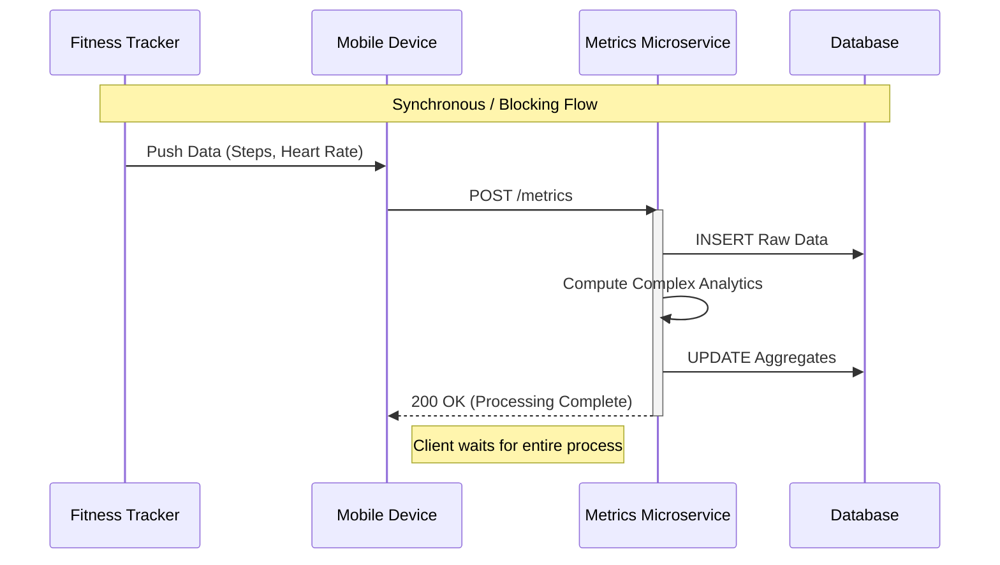

# Event Streaming

## What is Event Streaming?

In modern distributed systems, the traditional Request-Response model (often implemented via HTTP/REST) faces significant challenges when scaling to handle real-time data. While batch processing handles large volumes with high latency, and synchronous services handle low latency with lower throughput, **Event Streaming** bridges this gap by enabling continuous, asynchronous data processing.

Event streaming represents a paradigm shift from "data at rest" (querying a database) to "data in motion" (reacting to a continuous flow of events). It allows systems to capture, store, and process data in real-time as it is generated, decoupling the production of data from its consumption.

### The Limitations of Synchronous Architectures

To understand the necessity of event streaming, consider a synchronous microservices architecture. In this model, services communicate directly with one another, often resulting in **temporal coupling**—the sender and receiver must both be available and responsive at the exact same moment.

#### Case Study: Fitness Tracker Synchronization

Consider a fitness ecosystem where wearable devices sync activity data (steps, heart rate, SpO2) to a cloud backend.

**The Synchronous Approach (Request-Response):**
A mobile device collects data from the tracker and sends an HTTP POST request to a Metrics Service. The service processes this data, calculates aggregates, and writes to a database before returning a success response.

**Architectural Bottlenecks:**

1.  **High Latency & Poor UX**: The mobile client is blocked waiting for the server to complete complex calculations. If the database is slow, the user experience degrades immediately.
2.  **Temporal Coupling**: If the Metrics Service is undergoing maintenance or crashing, the mobile app cannot sync data. It must implement complex retry logic, draining the device's battery.
3.  **Resource Contention**: During peak load (e.g., everyone syncing after a morning run), the service may become overwhelmed. Synchronous systems handle "backpressure" poorly; requests simply time out or fail, leading to data loss.
4.  **Cascading Failures**: If the database slows down, the Metrics Service threads block, eventually causing the service to stop accepting new connections.

### The Event Streaming Solution

Event streaming solves these issues by introducing an **intermediate durable log** (Kafka).

1.  **Decoupling**: The mobile app produces an event to a Kafka topic and receives an immediate acknowledgment. It does not care *when* or *how* the data is processed.
2.  **Asynchronous Processing**: The Metrics Service consumes events from the topic at its own pace. If traffic spikes, the service lags slightly but doesn't crash.
3.  **Fault Tolerance**: If the Metrics Service goes down, events accumulate in the Kafka topic. When the service restarts, it resumes processing from where it left off, ensuring **zero data loss**.

## Core Concepts

### Events
An **event** records the fact that "something happened" in the world or in your business. It is also called a record or message in the documentation.

When you read or write data to Kafka, you do this in the form of events. Conceptually, an event has:
- **Key**: Optional identifier for the event
- **Value**: The actual data payload
- **Timestamp**: When the event occurred
- **Headers**: Optional metadata

### Topics
Events are organized and durably stored in **topics**. A topic is similar to a folder in a filesystem, and the events are the files in that folder.

Key characteristics:
- Topics are **multi-producer**: Multiple applications can write events to the same topic
- Topics are **multi-subscriber**: Multiple applications can read events from the same topic
- Events are **not deleted** after consumption (unlike traditional messaging systems)
- Events are **retained** based on a configurable retention policy

### Partitions
Topics are **partitioned**, meaning a topic is spread over a number of "buckets" located on different Kafka brokers.

Benefits of partitioning:
- **Scalability**: Data is distributed across multiple brokers
- **Parallelism**: Multiple consumers can read from different partitions simultaneously
- **Ordering**: Events with the same key go to the same partition, maintaining order

### Producers and Consumers
- **Producers**: Applications that publish (write) events to topics
- **Consumers**: Applications that subscribe to (read and process) events from topics

## Event Streaming Use Cases

### Real-Time Processing
- Processing payments and financial transactions in real-time
- Tracking and monitoring cars, trucks, fleets, and shipments in real-time
- Continuously capturing and analyzing sensor data from IoT devices

### Data Integration
- Connecting and integrating data from multiple sources
- Building data pipelines between systems
- Synchronizing data across microservices

### Event-Driven Architectures
- Decoupling microservices
- Building reactive systems
- Implementing CQRS (Command Query Responsibility Segregation) patterns

## Apache Kafka Overview

Apache Kafka is a distributed event streaming platform that provides:

1. **Publish and Subscribe**: Read and write streams of events
2. **Store**: Durably and reliably store streams of events
3. **Process**: Process streams of events as they occur or retrospectively

### Kafka Architecture Components

#### Brokers
- Kafka runs as a cluster of one or more servers (brokers)
- Brokers handle read/write requests and store data
- Brokers are designed to be fault-tolerant and scalable

#### ZooKeeper (Legacy) / KRaft (Modern)
- **ZooKeeper**: Traditionally used for cluster coordination and metadata management
- **KRaft**: New consensus protocol that eliminates ZooKeeper dependency (Kafka 3.0+)

#### Topics and Partitions
- Data is organized into topics
- Each topic is divided into partitions for scalability
- Partitions are replicated across brokers for fault tolerance

#### Replication
- Each partition has one leader and zero or more followers
- Leaders handle all reads and writes
- Followers replicate the leader's data
- If a leader fails, a follower becomes the new leader

## Event Streaming Guarantees

### Delivery Semantics
1. **At-most-once**: Messages may be lost but are never redelivered
2. **At-least-once**: Messages are never lost but may be redelivered
3. **Exactly-once**: Each message is delivered exactly once (requires transactions)

### Ordering Guarantees
- Events within a single partition are strictly ordered
- Events across different partitions have no ordering guarantee
- Use the same key for related events to maintain order

## Benefits of Event Streaming with Kafka

### Scalability
- Horizontally scalable by adding more brokers
- Partitioning enables parallel processing
- Can handle millions of events per second

### Durability
- Events are persisted to disk
- Replication ensures data is not lost
- Configurable retention policies

### Performance
- High throughput for both publishing and subscribing
- Low latency (milliseconds)
- Efficient batching and compression

### Flexibility
- Decouple producers and consumers
- Multiple consumers can read the same data
- Replay events from any point in time

## Getting Started with Kafka

### Prerequisites
- Java 8+ (Kafka runs on the JVM)
- For .NET applications: Confluent.Kafka NuGet package

### Basic Workflow
1. **Set up Kafka cluster** (or use a managed service like Confluent Cloud)
2. **Create topics** to organize your events
3. **Implement producers** to publish events
4. **Implement consumers** to process events
5. **Monitor and manage** your Kafka cluster

## Next Steps

- [Microservice for Producing Kafka Messages](./02-ProducingMessages.md)
- [Microservice for Consuming Kafka Messages](./03-ConsumingMessages.md)
- [Message Serialization](./04-MessageSerialization.md)
- [Working with Schemas](./05-WorkingWithSchemas.md)
- [Message Delivery and Transactions](./06-MessageDeliveryTransactions.md)
